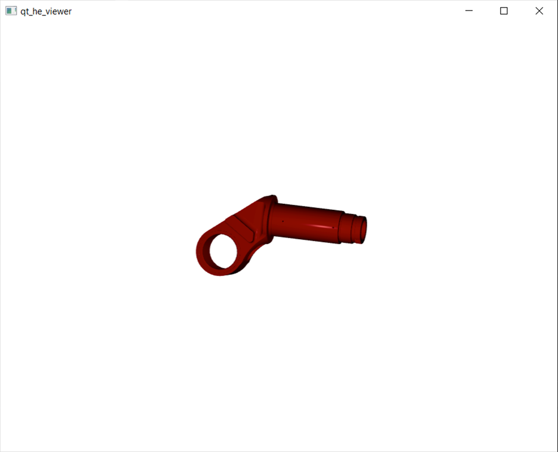
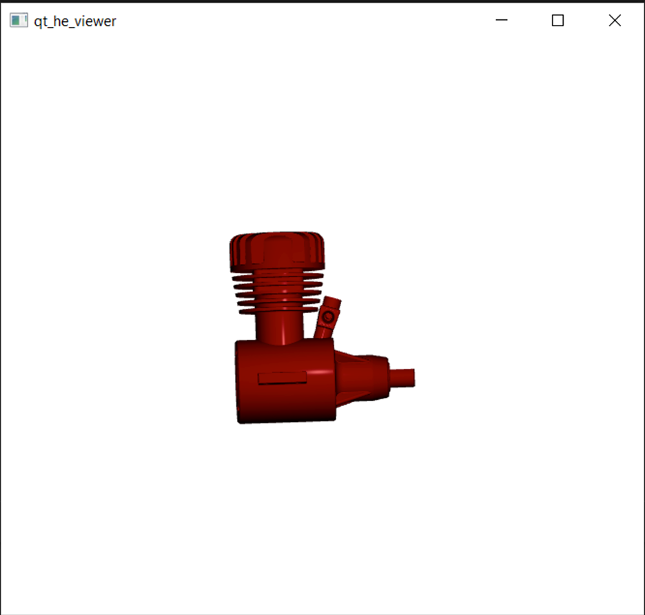
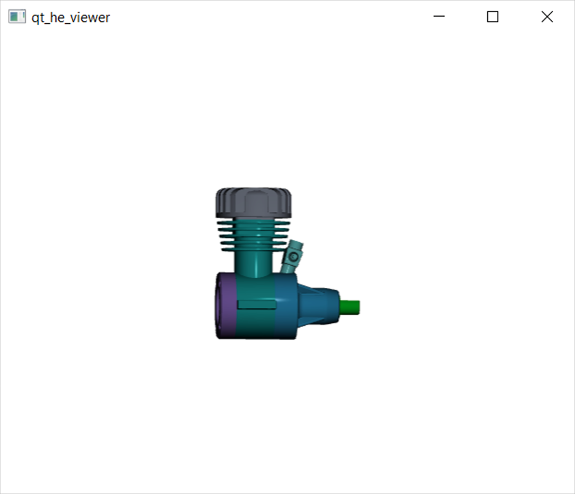

Learn to create a cross platform application that uses HOOPS Exchange to load a file and Qt3D to visualize it.

# Introduction

This tutorial will illustrate how to use HOOPS Exchange to retrieve graphical data for visualization workflows.
After completing this tutorial, you will have a basic understanding of how HOOPS Exchange provides access to a triangle mesh for parts, how to correctly orient them in 3D space, and how to determine each part’s basic color.

There are a few prerequisites for this tutorial.
First, you should have completed “Print the Assembly Structure” tutorial which covers several fundamental concepts such as file loading and data retrieval.
These topics won’t be duplicated here.

HOOPS Exchange is an SDK supported on Windows, macOS and Linux.
In the same spirit, we will be using Qt which is the most prevalent cross platform GUI toolkit.
Specifically, we will rely on Qt3D for cross platform graphics capabilities.
We’ll make every effort to minimize required expertise with the toolkit.
However, you must have [Qt 6 installed](https://www.qt.io/download-qt-installer) on your machine to complete this tutorial.

Like much of the cross-platform development community, Qt has begun a migration toward using CMake as the default build system.
Information on building Qt applications with CMake can be found [here](https://doc.qt.io/qt-6/cmake-manual.html).
This tutorial includes completed CMakeLists.txt file based on these concepts.
Recent distributions of Qt include bin/qt-cmake which you can use if you don’t already have CMake installed.

In-depth knowledge of Qt and CMake isn’t required, but both must be installed and ready for use.

# Step 0: Project Setup

## Clone the Project

We’re providing a git repository in support of this tutorial.
Clone the main branch to establish the starting point for the project.

```bash
git clone https://github.com/techsoft3d/he_qt_basic_view.git
```

## Configure

Using your favorite text editor, open the file `CMakeLists.txt`.
At the top of the file, you will see the variable `HOOPS_EXCHANGE_DIR` is set.
Update the value assigned to this variable to reflect your specific installation location.

## Build

Since the goal of this tutorial is to provide an understanding of HOOPS Exchange, we won’t spend much time on the topic of how to build and run a Qt application or IDE selection and configuration.
But just in case you’re unfamiliar with how it’s done, we’ll provide a few pointers here.

### Visual Studio Code

Visual Studio Code is a great option for cross platform development.
It supports C/C++ development and CMake as a build configuration system.
Microsoft provides an excellent overview of this use case [here](https://docs.microsoft.com/en-us/cpp/build/cmake-projects-in-visual-studio?view=msvc-170).

Edit the file _.vscode/settings.json_ and update the Qt paths to reflect your local installation of Qt.
After installing the CMake Tools extension, you can use the buttons found on the status bar to configure, build and run the application.


### Visual C++ on Windows

Open a Visual Studio command prompt and execute qtenv2.bat located in the bin folder of your Qt installation.
Next, create a subfolder in the project directory named _build_ and change to it.
Run `qt-cmake ..` to generate the required files.
This will create _qt_he_viewer.sln_ which you can open using the command `devenv qt_he_viewer.sln`.

## Run

After building the project, you’re ready to run the application.
When you run the binary, you’ll be presented with a standard File Open dialog.
The default location for the dialog is the folder containing sample data that ships with HOOPS Exchange.
Navigate to the PRC subfolder and choose _helloworld.prc_.
This file loads quickly and the empty 3D view appears.

Review the implementation of _main.cpp_ to gain familiarity with the program flow.
You’ll notice HOOPS Exchange is initialized and the user is prompted for an input file which is then loaded.
After loading the file, the code goes on to call `createScene,` configure a view, a camera, and a light source.

We’ll begin by creating the scene, in a somewhat abstract way.

# Step 1: Create the Scene

To create the scene, we must implement the function `createScene` which is defined in _Scene.cpp_.
Open the file in your editor.
You’ll notice it’s stubbed out to return an empty object.

In the HOOPS Exchange data model, the tessellation exists at the representation item level.
This means we will need to implement functionality that traverses the assembly structure, enters each part definition, and extracts the representation items contained within.
For each representation item we encounter, we will need to do a few things:

1.  Determine if the representation item should be shown.
2.  Generate tessellation data that we can easily render.
3.  Create a `Qt3D` mesh from the Exchange tessellation.
4.  Create a `Qt3D` material from the Exchange style definition.
5.  Create a `Qt3D` transform from the world position.

All the functionality we just listed has been stubbed out in the project you cloned, so we can write the complete body of createScene without much concern for how each step will be implemented.

First, we will declare and initialize a struct to control how to generate the tessellation for a representation item.
Add the following lines of code after the creation of `rootEntity.`

```cpp
// Create tessellation parameters to control behavior
A3DRWParamsTessellationData tess_params;
A3D_INITIALIZE_DATA( A3DRWParamsTessellationData, tess_params );
// Use the "preset" option for medium level of detail
tess_params.m_eTessellationLevelOfDetail = kA3DTessLODMedium;
```

For simplicity’s sake, we are using the level of detail enumeration in the options struct, which controls a set of specific tessellation options.
This is suitable for a basic viewing workflow.
We’ll use this option object shortly.

Next, we will iterate over each representation item by using the function `forEach_RepresentationItem` which we will implement later.
For now, let’s assume it exists and does what we want—that is, it traverses the assembly structure and for each part it encounters, it extracts representation items.
For each representation item, the provided lambda is invoked.
Add the following lines of code after the tessellation parameters are set up.

```cpp
// Iterate over each representation item
forEach_RepresentationItem(model_file, [&](EntityArray const &path) {

});
```

The lambda’s parameter is an `EntityArray,` which is a type alias for `QVector<A3DEntity*>`.
It contains an ordered list of pointers to each node in the assembly hierarchy.
The first item in the array is the model file, followed by a series of product occurrences, then a part.
Finally, the array terminates with the representation item encountered.

For the rest of this step, we will be adding code sequentially to the body of the lambda.

Sometimes a representation item should not be drawn.
To determine this, we will use a mechanism called cascaded attributes.
Cascaded attributes allow us to compute properties of a part within the context of the assembly that instances it.
A specific assembly can override color or visibility of a particular part.
We will encapsulate our use of cascaded attributes in a simple struct called `CascadedAttributes` which we’ll implement later.
It’s stubbed out, so for now let’s assume it behaves as we need it to.

Add the following lines of code within the body of the lambda:

```cpp
CascadedAttributes ca( path );
// Determine if this item should be skipped

if( ca->m_bRemoved || !ca->m_bShow ) {
  return;
}
```

`CascadedAttributes` overloads `operator->`, providing direct access to the `A3DMiscCascadedAttributesData` struct contained within.
If this instance of the representation item was removed or should not be shown, we bail out early.

If we don’t bail out early, our next step is to generate the tessellation in Exchange.
To do this, we add the following lines of code:

```cpp
A3DRiRepresentationItem *ri = path.back();

// Generate a tessellation using the options we declared above
A3DRiRepresentationItemComputeTessellation( ri, &tess_params);
```

Now that we’ve tessellated the representation item, we can access the data.

```cpp
// Fetch the data for this representation item
A3DRiRepresentationItemData rid;
A3D_INITIALIZE_DATA( A3DRiRepresentationItemData, rid );
if( A3D_SUCCESS != A3DRiRepresentationItemGet( ri, &rid ) ) {
  return;
}

// The tessellation is stored in m_pTessBase
auto tess_base = rid.m_pTessBase;
```

You should be well familiar with the pattern presented above which uses an opaque object handle (`ri`) to read its associated data into a struct.
The tessellation handle is then obtained from the struct, and we’re ready to use it.

Using the handle to the tessellation, we next attempt to create a `Qt3D` mesh.
If we’re successful, we create and apply its material and transform.
This is done as follows, using a few additional functions that are stubbed out already:

```cpp
// Create the mesh
if( auto mesh = createMesh( tess_base ) ) {
  auto node = new Qt3DCore::QEntity( rootEntity );
  node->addComponent( mesh );
  
  // Create the material
  if( auto material = createMaterial( ca->m_sStyle ) ) {
    node->addComponent( material );
  }

  // Create the transform
  if( auto transform = createTransform( path ) ) {
    node->addComponent( transform );
  }
}
```

If a mesh is obtained, we create a node to hold it, along with the material and transform.
The node is a child of `rootEntity.`

Still working within the body of the lambda, we have one final task.
Recall that any time you read data from Exchange, you must be sure to free any associated memory by calling the getter a second time providing a null handle.

Free the representation item data with the following (and final) line of code inside the body of the lambda:

```cpp
A3DRiRepresentationItemGet( nullptr, &rid );
```

This completes the high-level implementation of constructing the scene.
We’ve obviously left many implementation details for future steps, but we have accomplished the task of composing the basic scene graph needed to render a model.

# Step 2: Assembly Traversal

From the previous step, it should be somewhat clear what is left to be done.
We’ll attack each task in a systematic way, beginning with traversing the assembly hierarchy by way of implementing ForEach_RepresentationItem.

Let’s begin with a short description of how the function must behave.
Open the file ForEachRepresentationItem.cpp in your editor and you’ll find the stubbed-out version of the code:

```cpp
namespace {
  void forEach_Impl( EntityArray const &path, std::function<void(EntityArray
  const&)> const &fcn ) {
    Q_UNUSED(path);
    Q_UNUSED(fcn);
  }
}

void forEach_RepresentationItem( A3DAsmModelFile *model_file,
std::function<void(EntityArray const&)> const &fcn ) {
  forEach_Impl( { model_file }, fcn );
}
```

The function takes two parameters.
The first is an opaque handle to the model file.
The second parameter is a function object to be invoked as a callback.
And, as we discussed in Step 1, the implementation is expected to traverse the assembly structure and invoke the callback for each representation item encountered.

The callback function is invoked with a single parameter: an `EntityArray` containing an ordered list of opaque handles to Exchange objects.
The list is sequential, beginning with the `A3DAsmModelFile` handle, followed by one or more `A3DAsmProductOccurrence` handle.
The handles represent the assembly hierarchy leading to a part.
Of course, next is the `A3DAsmPartDefinition` handle.
Lastly, the path contains the `A3DRiRepresentationItem` handle encountered.
If the part definition contains an `A3DRiSet` object (a representation item set), there will be more than one `A3DRiRepresentationItem` handle in the path.

The public function immediately invokes an anonymous implementation that takes an `EntityArray` instead of an `A3DAsmModelFile` handle.
The usefulness of this will quickly become clear.
The implementation will care only about the last handle in the provided path.

A great place to start is at the beginning.
So, let’s implement the case we already know about- when this function is invoked with a single object in the path, which is an `A3DAsmModelFile` handle.
In this case, we want to add each child `A3DAsmProductOccurrence` handle to the path and call the function again to dig deeper.
It should look something like this:

```cpp
auto const ntt = path.back();
auto type = kA3DTypeUnknown;
if(A3D_SUCCESS != A3DEntityGetType( ntt, &type) ) {
  return;
}

EntityArray children;
if(kA3DTypeAsmModelFile == type) {
  A3DAsmModelFileData mfd;
  A3D_INITIALIZE_DATA(A3DAsmModelFileData, mfd);
  if(A3D_SUCCESS != A3DAsmModelFileGet( ntt, &mfd ) ) {
    return;
  }
  children = EntityArray( mfd.m_ppPOccurrences, mfd.m_ppPOccurrences +
  mfd.m_uiPOccurrencesSize );
  A3DAsmModelFileGet( nullptr, &mfd );
}

for( auto child : children ) {
  auto child_path = path;
  child_path.push_back( child );
  forEach_Impl( child_path, fcn );
}
```

This implementation is recursive and invokes itself with an `A3DAsmProductOccurrence` handle as the value of `path.back()`.
Let’s augment the code to handle this case by adding to the if clause.

```cpp
else if( kA3DTypeAsmProductOccurrence == type ) {
  A3DAsmProductOccurrenceData pod;
  A3D_INITIALIZE_DATA(A3DAsmProductOccurrenceData, pod);
  if(A3D_SUCCESS != A3DAsmProductOccurrenceGet( ntt, &pod ) ) {
    return;
  }
  children = EntityArray( pod.m_ppPOccurrences, pod.m_ppPOccurrences +
  pod.m_uiPOccurrencesSize );
  A3DAsmProductOccurrenceGet( nullptr, &pod );
}
```

And where to go from here? This handles the entire assembly hierarchy, up to the point where a node contains a part.
So, in addition to processing children as shown in the above implementation, we must check to see if an `A3DAsmProductOccurrence` contains a part.

Determining if a part exists is sometimes as easy as checking the `m_pPart` field in the product occurrence struct.
But this doesn’t capture the common case of shared part instancing.
Part instancing is achieved by utilizing the `m_pPrototype` handle, which references the shared definition of an assembly node.
If a node has a null `m_pPart` handle, you must also recursively check its prototype, if it has one.
To implement this logic, add the getPart function at the top of the anonymous namespace.

```cpp
A3DAsmPartDefinition *getPart( A3DAsmProductOccurrence *po ) {
  if( nullptr == po ) {
    return nullptr;
  }

  A3DAsmProductOccurrenceData pod;
  A3D_INITIALIZE_DATA(A3DAsmProductOccurrenceData, pod);
  if(A3D_SUCCESS != A3DAsmProductOccurrenceGet( po, &pod ) ) {
    return nullptr;
  }
  auto part = pod.m_pPart ? pod.m_pPart : getPart( pod.m_pPrototype );
  A3DAsmProductOccurrenceGet( nullptr, &pod );
  return part;
  }
```

Now, we can use this function inside the clause you just added that handles `A3DAsmPartDefinition` objects:

```cpp
  else if( kA3DTypeAsmProductOccurrence == type ) {
  A3DAsmProductOccurrenceData pod;
  A3D_INITIALIZE_DATA(A3DAsmProductOccurrenceData, pod);
  if(A3D_SUCCESS != A3DAsmProductOccurrenceGet( ntt, &pod ) ) {
    return;
  }
  children = EntityArray( pod.m_ppPOccurrences, pod.m_ppPOccurrences +
  pod.m_uiPOccurrencesSize );
  if( auto part = pod.m_pPart ? pod.m_pPart : getPart( pod.m_pPrototype ) ) {
    children.insert( children.begin(), part );
  }
  A3DAsmProductOccurrenceGet( nullptr, &pod );
}
```

We’ve made it to a part definition!
So let add part definition traversal to the clause:

```cpp
} else if( kA3DTypeAsmPartDefinition == type ) {
  A3DAsmPartDefinitionData pdd;
  A3D_INITIALIZE_DATA(A3DAsmPartDefinitionData, pdd);
  if(A3D_SUCCESS != A3DAsmPartDefinitionGet( ntt, &pdd ) ) {
    return;
  }
  children = EntityArray( pdd.m_ppRepItems, pdd.m_ppRepItems +
  pdd.m_uiRepItemsSize );
  A3DAsmPartDefinitionGet( nullptr, &pdd );
```

Landing us on representation items, where we should be invoking the callback function, providing the path used to get us here.
But before we can do that, we mustn’t forget the specific representation item type that is a set.
If this object type is encountered, we must traverse a bit further.

Handling all these details should look something like this, as the final else clause of the conditional:

```cpp
 else {
  if( kA3DTypeRiSet == type ) {
    A3DRiSetData risd;
    A3D_INITIALIZE_DATA(A3DRiSetData, risd);
    if(A3D_SUCCESS != A3DRiSetGet( ntt, &risd ) ) {
      return;
    }
    children = EntityArray( risd.m_ppRepItems, risd.m_ppRepItems + risd.m_uiRepItemsSize );
    A3DRiSetGet( nullptr, &risd );
  } else {
    fcn( path );
  }
}
```

If you’re feeling a little giddy right now, don’t worry that’s perfectly normal.
Together, we’ve successfully implemented a well-behaved function for traversing the Exchange product structure in a way that is very useful to us.
By using a function object, we’ve separated the traversal from the work done to build the scene graph.
And you’ve probably learned a little something about the data structure of Exchange in the process.

# Step 3: Cascaded Attributes

Let’s continue implementing each of the functions we used when creating the scene in step 1.
The next stubbed out functionality we encounter is inside the lambda is the `CascadedAttributes` struct.
This struct is implemented in the file _CascadedAddtributes.h_.
Open it up and have a look.
You’ll find an empty constructor and destructor, which we’ll implement now.

The constructor has an argument, which you should be quite familiar with by now.
It is an EntityArray representing the path of Exchange objects leading from the model file to the representation item we’re interested in.
The job of our constructor is to compute the `A3DMiscCascadedAttributesData` object corresponding to this path.
We’ll do this by following to guidance provided by our Programming Guide’s section on Cascaded Attributes found here.

Implement the constructor as follows:

```cpp
// Create a vector to hold the cascaded attributes handles
QVector<A3DMiscCascadedAttributes*> cascaded_attribs;

// Create the "root" cascaded attribute handle
cascaded_attribs.push_back( nullptr );
A3DMiscCascadedAttributesCreate( &cascaded_attribs.back() );

// for each entity in the path,
for( auto ntt : path ) {
  if( A3DEntityIsBaseWithGraphicsType( ntt ) ) {
    // get the handle to the previous cascaded attributes
    auto father = cascaded_attribs.back();
    
    // create a new cascaded attributes handle for this entity
    cascaded_attribs.push_back( nullptr );
    A3DMiscCascadedAttributesCreate( &cascaded_attribs.back() );
    
    // push this handle onto the stack
    A3DMiscCascadedAttributesPush( cascaded_attribs.back(), ntt, father );
  }
}

// Compute the cascaded attributes data
A3D_INITIALIZE_DATA(A3DMiscCascadedAttributesData, d);
A3DMiscCascadedAttributesGet( cascaded_attribs.back(), &d );

for( auto attrib : cascaded_attribs ) {
    A3DMiscCascadedAttributesDelete( attrib );
}
```

The comments within the code should do a reasonable job of explaining what the approach is.

Once this object is constructed, we’ve populated the data field appropriately.
All that’s left to do is to free the object in the destructor.
Add this line of code to the destructor:

```cpp
A3DMiscCascadedAttributesGet( nullptr, &d );
```

And that’s all that’s to it.

Completing this step means you’ve created a simple struct to manage the cascaded attributes for an arbitrary EntityArray.
This pairs nicely with the rest of our workflow, and directly leverages the method we implemented for traversing the product structure.

# Step 4: Creating the Mesh

In this next step, we will walk through the code required to read the tessellation from HOOPS Exchange and create a corresponding `Qt3D` object suitable for rendering.
This work will be completed in the file `Mesh.cpp`.
Open it in your editor now, and you’ll find the familiar stubbed out implementation.

To begin the task, we should perform some sanity checks on the incoming handle.
Specifically, we want to ensure it is the correct concrete object type we want to handle for this basic viewing workflow.

```cpp
A3DEEntityType tess_type = kA3DTypeUnknown;
if(A3D_SUCCESS != A3DEntityGetType( tess_base, &tess_type ) ) {
  return nullptr;
}

// Ensure we're working only on the type we care about
if( tess_type != kA3DTypeTess3D ) {
  return nullptr;
}
```

The handle passed into the function is a base type called `A3DTessBase.`
For the purposes of this basic viewing workflow, we’ll only handle the concrete type `A3DTess3D.`
If a null handle is passed in, this code will handle it correctly and bail out.

The base tessellation type contains information we’ll need that is common to all derived types, specifically the array of coordinates.
Add the code to read the base data from HOOPS Exchange.

```cpp
// Read the coordinate array from the tess base data
A3DTessBaseData tbd;
A3D_INITIALIZE_DATA(A3DTessBaseData, tbd);
if( A3D_SUCCESS != A3DTessBaseGet( tess_base, &tbd ) ) {
  return nullptr;
}

A3DDouble const *coords = tbd.m_pdCoords;
A3DUns32 const n_coords = tbd.m_uiCoordSize;
```

The coordinate data is provided as a C-style array - that is, it’s a pointer to an array of doubles, of a specified length.
The size will always be evenly divisible by 3.

The next task it to obtain the data associated with the concrete tessellation type.
We’ll start by obtaining the C-style array for the normal vectors.

```cpp
3DTess3DData t3dd;
A3D_INITIALIZE_DATA( A3DTess3DData, t3dd );
if( A3D_SUCCESS != A3DTess3DGet( tess_base, &t3dd ) ) {
A3DTessBaseGet( nullptr, &tbd );
  return nullptr;
}

A3DDouble const *normals = t3dd.m_pdNormals;
A3DUns32 const n_normals = t3dd.m_uiNormalSize;
```

Also stored in `A3DTess3DData` is an array of `A3DTessFaceData` objects, one per topological face in the exact geometry representation.
Now that we have the array of coordinates and normal vectors, we can loop over the face data an interpret the tessellation referenced within.
As we loop over the faces, we will construct a single Qt buffer containing the positions and normal vectors, along with a simple "flattened" index array.

Each instance of `A3DTessFaceData` contains a bit-flag field describing how the triangle data is stored.
By using HOOPS Exchange to generate the tessellation, we are reasonably assured that only basic triangles are present, so we don’t have to worry about fans, strips, and other permutations of how normal vectors and texture coordinates may occur when reading the tessellation from the input file itself.
We took a performance hit by generating the tessellation, but the benefit is a simplified code block for reading the data that was generated.

Here’s the loop for reading the triangle data from HOOPS Exchange.
It interleaves the triangle vertex position and its normal vector, as commonly done in vertex buffer objects used in visualization workflows.

```cpp
QVector<quint32> q_indices;
QByteArray bufferBytes;
quint32 const stride = sizeof(float) * 6; // 3 for vertex + 3 for normal
for( auto tess_face_idx = 0u; tess_face_idx < t3dd.m_uiFaceTessSize; ++tess_face_idx ) { A3DTessFaceData const &d = t3dd.m_psFaceTessData[tess_face_idx];
  auto sz_tri_idx = 0u;
  auto ti_index = d.m_uiStartTriangulated;
  if(kA3DTessFaceDataTriangle & d.m_usUsedEntitiesFlags) {
    auto const num_tris = d.m_puiSizesTriangulated[sz_tri_idx++];
    auto const pt_count = num_tris * 3; // 3 pts per triangle
    auto const old_sz = bufferBytes.size();
    bufferBytes.resize(bufferBytes.size() + stride * pt_count);
    auto fptr = reinterpret_cast<float*>(bufferBytes.data() + old_sz);
    for(auto tri = 0u; tri < num_tris; tri++) {
    for(auto vert = 0u; vert < 3u; vert++) {
      auto const &normal_index =
      t3dd.m_puiTriangulatedIndexes[ti_index++];
      auto const &coord_index =
      t3dd.m_puiTriangulatedIndexes[ti_index++];

      *fptr++ = coords[coord_index];
      *fptr++ = coords[coord_index+1];
      *fptr++ = coords[coord_index+2];
      *fptr++ = normals[normal_index];
      *fptr++ = normals[normal_index+1];
      *fptr++ = normals[normal_index+2];
      q_indices.push_back( q_indices.size() );
      }
    }
  }
}
```

When this loop finishes, we are left with a raw buffer containing the floating-point vertex positions and normal vectors for every triangle in the body.
They’re stored sequentially, without considering the possibility of shared index values.
This results in a potentially larger buffer than needed but simplifies the code we’re presenting.

We have all the data we need from Exchange, so let’s clean up after ourselves.

```cpp
A3DTess3DGet( nullptr, &t3dd );
A3DTessBaseGet( nullptr, &tbd );
```

We must complete the function by creating the `Qt3D` primitives needed to render the data we just captured.
As mentioned at the outset of this tutorial, we won’t spend much time describing the specifics of `Qt3D,` rather present the code as needed:

```cpp
auto buf = new Qt3DCore::QBuffer();

buf->setData( bufferBytes );
auto geometry = new QGeometry;
auto position_attribute = new QAttribute( buf,
QAttribute::defaultPositionAttributeName(), QAttribute::Float, 3, q_indices.size(), 0, stride );
geometry->addAttribute( position_attribute );

auto normal_attribute = new QAttribute( buf,
QAttribute::defaultNormalAttributeName(), QAttribute::Float, 3, q_indices.size(), sizeof(float) * 3, stride );
geometry->addAttribute( normal_attribute );


QByteArray indexBytes;
QAttribute::VertexBaseType ty;
if (q_indices.size() < 65536) {
  // we can use USHORT
  ty = QAttribute::UnsignedShort;
  indexBytes.resize(q_indices.size() * sizeof(quint16));
  quint16 *usptr = reinterpret_cast<quint16*>(indexBytes.data());
  for (int i = 0; i < int(q_indices.size()); ++i)
    *usptr++ = static_cast<quint16>(q_indices.at(i));
} else {
  // use UINT - no conversion needed, but let's ensure int is 32-bit!
  ty = QAttribute::UnsignedInt;
  Q_ASSERT(sizeof(int) == sizeof(quint32));
  indexBytes.resize(q_indices.size() * sizeof(quint32));
  memcpy(indexBytes.data(), reinterpret_cast<const char*>(q_indices.data()), indexBytes.size());
}

auto *indexBuffer = new Qt3DCore::QBuffer(); indexBuffer->setData( indexBytes );
QAttribute *indexAttribute = new QAttribute(indexBuffer, ty, 1, q_indices.size());
indexAttribute->setAttributeType(QAttribute::IndexAttribute);
geometry->addAttribute(indexAttribute);

auto renderer = new Qt3DRender::QGeometryRenderer();
renderer->setGeometry( geometry );

return renderer
```

You’ve reached a major milestone with the completion of this step.
Now, you can load a single part and view it.
It will appear in a default color (red), but it should be visible.
Assemblies won’t visualize correctly because we aren’t handling transforms yet, but load the sample file samples/data/prc/Flange287.
prc and you should see the following:



Next, we’ll focus on getting transforms correct so we can visualize assemblies correctly.

# Step 5: Creating the Transform

Now that we have something on the screen, let’s add the code needed to orient objects correctly in the world.
Once complete, we’ll be able to load and view assemblies.

In an assembly file, individual nodes of the assembly tree contain local transforms.
Each transform is applied relative to its parent.
This means, to compute a world transform for each part, we must accumulate the transform of each assembly node in the path that leads to the part instance.

From this description, we can begin writing the implementation for createTransform (found in Transform.cpp) as follows:

```cpp
QMatrix4x4 net_matrix;
for( auto const ntt : path ) {
  A3DMiscTransformation *xform = getTransform( ntt );
  net_matrix *= toMatrix( xform );
}
auto xform = new Qt3DCore::QTransform();
xform->setMatrix( net_matrix );
return xform;
```

This implementation does exactly what we described using the convenient fact that path includes the sequential list of handles to each object in the assembly hierarchy leading to the representation item.
It uses two functions we must still define, `getTransform` and `toMatrix.`
We’ll implement them in an anonymous namespace above `createTransform.`

We’ll start with `getTransform.`
As you can see from its usage, this function takes an entity handle and returns an `A3DMiscTransformation` handle.
We must implement this function to determine the type of entity that was passed in, and return the transformation from it, if it exists.

In the path from a model file to a representation item, the only object types that may contain a transformation are `A3DAsmProductOccurrence` and `A3DRiRepresentationItem.`
Our code must handle both cases.
Implement the `getTransform` function as follows:

```cpp
namespace {
    A3DMiscTransformation *getTransform( A3DEntity *ntt ) {
        A3DMiscTransformation *result = nullptr;
        A3DEEntityType ntt_type = kA3DTypeUnknown;
        A3DEntityGetType(ntt, &ntt_type );
        if( kA3DTypeAsmProductOccurrence == ntt_type ) {
            A3DAsmProductOccurrenceData d;
            A3D_INITIALIZE_DATA(A3DAsmProductOccurrenceData, d);
            A3DAsmProductOccurrenceGet( ntt, &d );
            result = d.m_pLocation ? d.m_pLocation : getTransform( d.m_pPrototype );
            A3DAsmProductOccurrenceGet( nullptr, &d );
        } else if( ntt_type > kA3DTypeRi && ntt_type <= kA3DTypeRiCoordinateSystemItem) {
            A3DRiRepresentationItemData d;
            A3D_INITIALIZE_DATA(A3DRiRepresentationItemData, d);
            A3DRiRepresentationItemGet( ntt, &d );
            if( auto ti_cs = d.m_pCoordinateSystem ) {
                A3DRiCoordinateSystemData cs_d;
                A3D_INITIALIZE_DATA(A3DRiCoordinateSystemData, cs_d);
                A3DRiCoordinateSystemGet( d.m_pCoordinateSystem, &cs_d );
                result = cs_d.m_pTransformation;
                A3DRiCoordinateSystemGet( nullptr, &cs_d );
            }
            A3DRiRepresentationItemGet( nullptr, &d );
        }
        return result;
    }
}
```

There are two items worth noting within this implementation.
Perhaps you’ve already spotted them.

First, inside the if clause for `kA3DTypeAsmProductOccurrence,` you will likely have noticed the ternary operator that options result.
It’s implemented to recursively call `getTransform` using the prototype pointer if `m_pLocation` is null.
This is because an assembly node "inherits" the location field from its prototype when it isn’t overridden.

The second note is in the else if condition itself.
Because `A3DEntityGetType` returns the concrete type of the entity provided, we must use the logic presented here to see if the entity is any one of all possible types of representation items.
It unfortunately relies on the enumeration values.
I’m open to suggestions on a better way for handling this (_ExchangeToolkit.h_ has a function called `isRepresentationItem`).

With an `A3DMiscTransformation` handle, we are now ready to implement toMatrix, which must convert the handle to a `QMatrix4x4.`
`A3DMiscTranformation` is a base class handle with two possible concrete types: `A3DMiscCartesianTransformation` and `A3DMiscGeneralTransformation.`
We must handle both cases.
To do so, create the function in the top of the anonymous namespace with this code:

```cpp
QMatrix4x4 toMatrix( A3DMiscTransformation *xfrm ) {
  if( xfrm ) {
    A3DEEntityType xfrm_type = kA3DTypeUnknown;
    A3DEntityGetType( xfrm, &xfrm_type );
    switch( xfrm_type ) {
      case kA3DTypeMiscCartesianTransformation:
        return getMatrixFromCartesian( xfrm );
        break;
      case kA3DTypeMiscGeneralTransformation:
        return getMatrixFromGeneralTransformation( xfrm );
        break;
      default:
        throw std::invalid_argument( "Unexpected type." );
        break;
    }
  }
  return QMatrix4x4();
}
```


The general transformation presents its matrix as a 16-element array of doubles representing a 4x4 matrix.
It’s a simple matter of copying these values into the `QMatrix4x4` object.
Create the following function at the top of the anonymous namespace to handle this case.

```cpp
QMatrix4x4 getMatrixFromGeneralTransformation( A3DMiscGeneralTransformation *xform ) {
  A3DMiscGeneralTransformationData d;
  A3D_INITIALIZE_DATA(A3DMiscGeneralTransformationData, d);
  A3DMiscGeneralTransformationGet( xform, &d );
  
  auto const coeff = d.m_adCoeff;
  QMatrix4x4 result;
  for( auto row = 0u; row < 4u; ++row ) {
    for( auto col = 0u; col < 4u; ++col ) {
      result(row,col) = static_cast<float>(coeff[row + col * 4]);
    }
  }
return result;
```

Handling the case of a cartesian transformation is a bit more involved.
We must read the basic data and perform some elemental algebra to compute the values for the matrix.
Add this code to the anonymous namespace for extracting the cartesian transformation data.

```cpp
QMatrix4x4 getMatrixFromCartesian( A3DMiscCartesianTransformation *xform ) {
  A3DMiscCartesianTransformationData d;
  A3D_INITIALIZE_DATA(A3DMiscCartesianTransformationData, d);
  A3DMiscCartesianTransformationGet( xform, &d );
  auto const mirror = (d.m_ucBehaviour & kA3DTransformationMirror) ? -1. : 1.;
  auto const s = toQVector3D( d.m_sScale );
  auto const o = toQVector3D( d.m_sOrigin );
  auto const x = toQVector3D( d.m_sXVector );
  auto const y = toQVector3D( d.m_sYVector );
  auto const z = QVector3D::crossProduct( x, y ) * mirror;
  A3DMiscCartesianTransformationGet( nullptr, &d );
  return QMatrix4x4(
    x.x() * s.x(), y.x() * s.y(), z.x() * s.z(), o.x(),
    x.y() * x.x(), y.y() * s.y(), z.y() * s.z(), o.y(),
    x.z() * s.x(), y.z() * s.y(), z.z() * s.z(), o.z(),
    0.f,           0.f,           0.f,           1.f
  );
}
```


This code is using the function `toQVector3D`, which creates a `QVector3D` from an `A3DVector3DData` object.
It is implemented in _Transform.h_.

Once you’ve added this function, you’ll have a completed implementation ready for testing.
Run your application and load an assembly file, such as _data/prc/\_micro engine.prc_.



# Step 6: Creating the Materials

The final step in this tutorial is to create a Qt3D material that is representative of the style data we read from Exchange.
To determine how a part should look, we must rely on data retrieved from the cascaded attributes helper from Step 3.
Recall that visibility is determined by the specific path through an assembly.
The style in which a part should be drawn is computed in the same way.
In the body of `createScene,` we call the function `createMaterial` and pass in the style data from our cascaded attributes helper.

Open the file _Material_.
cpp so we can begin implementing the function.
You will see the default material is created, which is why all parts have shown up as red.
The style data object passed into this function can specify material information in 3 different ways.
The easiest case is a single color.
Let’s begin by handling that case.

Update the function as follows:

```cpp
Qt3DCore::QComponent *createMaterial( A3DGraphStyleData const &style_data ) {
  auto material = new Qt3DExtras::QDiffuseSpecularMaterial();
  material->setDiffuse(QColor("red"));
  if( !style_data.m_bMaterial ) {
    auto const a = style_data.m_bIsTransparencyDefined ? style_data.m_ucTransparency : 255u;
    material->setDiffuse(getColor( style_data.m_uiRgbColorIndex, a ));
  }
  return material;
}
```


Here, we’re using a function we must still implement called `getColor.`
This function takes an RGB color index (and alpha) and returns a `QColor.`
Implement `getColor` in an anonymous namespace above `createMaterial.`

```cpp
namespace {
  QColor getColor( A3DUns32 const &color_idx, int const &a ) {
    if( A3D_DEFAULT_COLOR_INDEX == color_idx ) {
      return QColor( 255, 0, 0 );
    }
  
    A3DGraphRgbColorData rgb_color_data;
    A3D_INITIALIZE_DATA( A3DGraphRgbColorData, rgb_color_data );
    A3DGlobalGetGraphRgbColorData( color_idx, &rgb_color_data );
    auto const &r = rgb_color_data.m_dRed;
    auto const &g = rgb_color_data.m_dGreen;
    auto const &b = rgb_color_data.m_dBlue;
    return QColor( static_cast<int>(r * 255), static_cast<int>(g * 255), static_cast<int>(b * 255), a);
  }
}
```


Color data is stored by integer index in HOOPS Exchange.
This implementation first checks if the index is equal to `A3D_DEFAULT_COLOR_INDEX`, indicating that no color has been assigned.
In this case, we’re returning red, which you’d *think* is my favorite color, but you’d be wrong.
Creating a `QColor` object from the double precision definition from Exchange is a simple matter that follows naturally.

With this implementation, you’ll find many parts will now load and display in their correct color.



Let’s add an additional case to handle two or the three forms style data can take.
Update the if clause in createMaterial with the following else block.

```cpp
else {
  A3DBool is_texuture = false;
  A3DGlobalIsMaterialTexture( style_data.m_uiRgbColorIndex, &is_texuture );
  if( ! is_texuture ) {
    A3DGraphMaterialData material_data;
    A3D_INITIALIZE_DATA( A3DGraphMaterialData, material_data );
    A3DGlobalGetGraphMaterialData( style_data.m_uiRgbColorIndex, &material_data );
    auto const ambient_color = getColor( material_data.m_uiAmbient, static_cast<int>(255 * material_data.m_dAmbientAlpha) );
    auto const diffuse_color = getColor( material_data.m_uiDiffuse, static_cast<int>(255 * material_data.m_dDiffuseAlpha) );
    if( ambient_color.alpha() == 255 && diffuse_color.alpha() == 0 ) {
    material->setDiffuse( ambient_color );
    } else if( ambient_color.alpha() == 0 && diffuse_color.alpha() == 255 ) {
        material->setDiffuse( diffuse_color );
    }
    material->setSpecular(getColor( material_data.m_uiSpecular, material_data.m_dSpecularAlpha ));
  }
}
```


This handles the slightly more complicated material definition.
Handling textures is beyond the scope of this basic viewing tutorial.
We’ve handled the two most common cases for style definitions, and we are returning a reasonable Qt3D material.

# Conclusion

Congratulations!
You’ve made it through a very detailed tutorial that covers the basic viewing workflow.
In doing so, you’ve learned about the HOOPS Exchange assembly structure and its effect on how parts should be displayed.
You learned how to read the basic form of tessellation and interpret it for a common buffer-based viewing technique.
We placed objects in their correct location and orientation by reading transform data, and finally applied a reasonable material to each part so they appear as intended.


